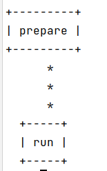

## Создание виртуального окружения

```shell
python3 -m venv venv
```

## Установка зависимостей

Необходимо войти в виртуальное окружение (зависит от платформы) и выполнить

```shell
pip3 install -r requirements.txt   
```

для установки продуктового окружения или

```shell
pip3 install -r dev_requirements.txt   
```

для установки окружения для разработки.

Отличаются они тем, что в окружении для разработки есть линтер `pylint`, `snakeviz` для визуализации измерений
профайлера, `twine` для создания и обновления пакета

## Создание пакета и публикация в pypi-test

Создаём пакет

```shell
python3 -m build
```

Загружаем в pypi-test

```shell
twine upload -r testpypi dist/*
```

Получаем ссылку
[https://test.pypi.org/project/homework-test-package-2/1.0/](https://test.pypi.org/project/homework-test-package-2/1.0/)

## Установка пакета

```shell
pip3 install -i https://test.pypi.org/simple/ --extra-index-url https://pypi.org/simple homework-test-package-2==1.0
```

Объясню зачем здесь `--extra-index-url`: мне уже приходилось устанавливать пакет из pypi-test и вот оказывается, что
если сделать просто `pip install -i https://test.pypi.org/simple/ homework-test-package-2==1.0`, то зависимости
устанавливаемого
пакета будут также тянутся из pypi-test, что плохо -- там нет некоторых распространённых пакетов, соответственно
установка
может завершиться неудачно. Поэтому командой приведённой выше мы устанавливаем наш пакет из pypi-test, а его зависимости
из
дефолтного pypi.

## Форматеры, линтеры, плагины

Для форматирования был выбран `isort` и `black`. К flake8 я добавил следующие плагины:

- `flake8-cognitive-complexity` проверяет сложность функций
- `flake8-expression-complexity` проверяет сложность выражений
- `flake8-encodings` обнаруживает ошибки с кодировкой
- `flake8-return` проверяет, корректность кода касательно `return`
- `flake8-implicit-str-concat` проверяет, что строчки правильно конкатенируются

```shell
flake8 --max-expression-complexity=4 --max-cognitive-complexity=4 src
```

## Пайплайн

Для запуска пайплана выполнить

```shell
dvc repro
```

После чего в `data/` появятся сгенерированные данные, а в `artifacts/` полученные результаты. Дефолтные параметры 
располагаются в `params.yaml`.

DAG выглядит крайне просто
```shell
dvc dag
```


## CLI
```shell
python src/main.py --help
```
```
usage: main.py [-h] [-d MAX_DEPTH] [-l MIN_SAMPLES_LEAF]              

optional arguments:
  -h, --help            show this help message and exit
  -d MAX_DEPTH, --max_depth MAX_DEPTH
  -l MIN_SAMPLES_LEAF, --min_samples_leaf MIN_SAMPLES_LEAF
```
Например, вызов 
```shell
python src/main.py -d 1 -l 10
```
Обучит дерево с максимальной глубиной 1 и минимальным 10 точек в листе